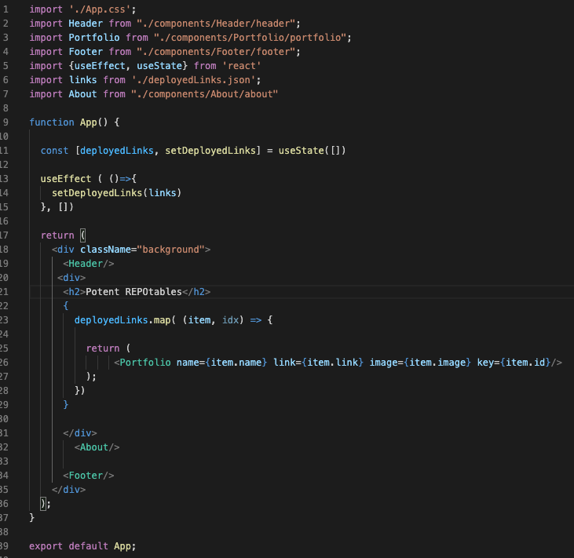

# Repo-React-ion

Update portfilio with the immaculate capabilities of React. You're welcome world.

## Deployed Link
- https://ryandelonhull.github.io/Repo-React-ion/

## User Story
- As a recruiter i take one look at this Flaming Specimen of Awesomeness and i have no choice but to grant this man the keys to the castle. - Richard Branson 

## Screenshot

## Code Snippet

## Author 

### Ry Hull
 - https://github.com/ryandelonhull
 - https://linkedin.com/in/ryan-hull-94003144
 - https://ryandelonhull.github.io/Repo-React-ion/

 ## *Acknowledgments*

 Big thank you to Jerome, Mahi, Manuel, Kerwin, Roger, and my tutor for wading into the deep waters of coding with the class and keeping me afloat with their instruction and guidance. Thank you to my fellow classmates for including me in the study and homework sessions as working together on a problem has been a great teacher also.
